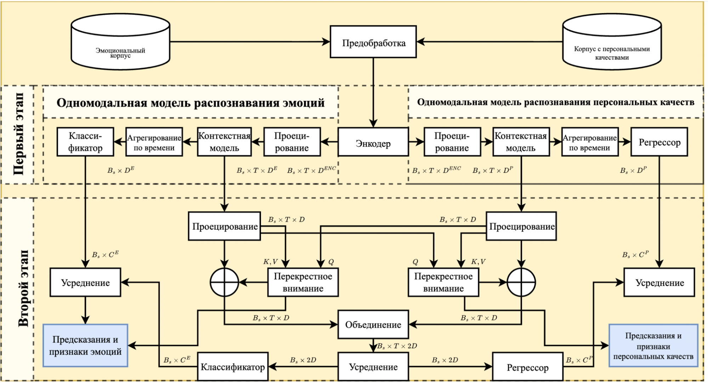
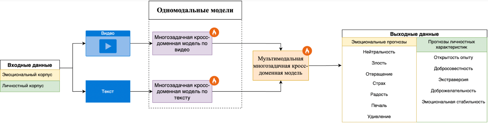
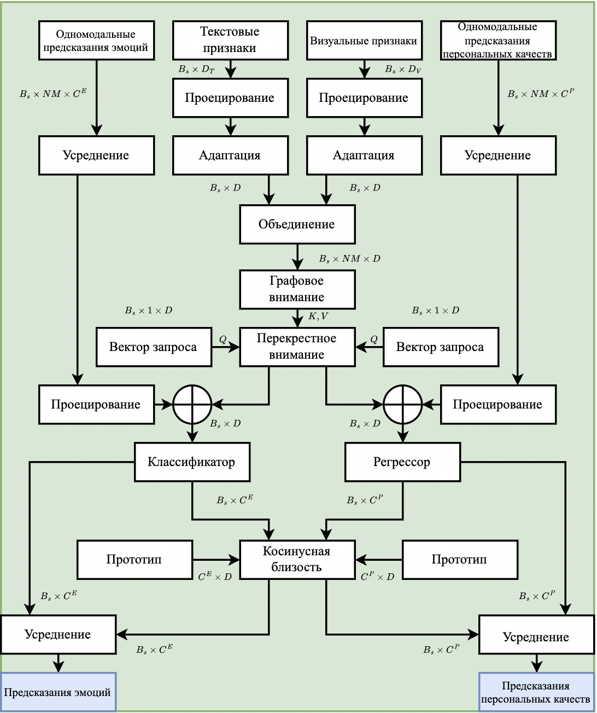

# Модели и методы полуконтролируемого кросс-доменного обучения текстовых представлений с адаптивным согласованием латентных признаков в архитектурах больших языковых моделей

## Аннотация  
Актуальными задачами в области машинного обучения на данный момент являются кросс-доменное обучение для переноса знаний между областями без использования совместной разметки, а также внедрение больших языковых моделей. В данной работе разработан  метод полуконтролируемого кросс-доменного обучения текстовых представлений с адаптивным согласовании латентных признаков больших языковых моделях, направленный на повышение качества обобщения и переноса знаний между доменами при ограниченных аннотированных данных. Метод протестирован на задачах классификации эмоций и определения персональных качеств личности, что позволит использовать его в эмпатичных и контекстно-ориентированных интеллектуальных системах. Итоговый метод состоит из двух компонентов: две одномодальные кросс-доменные модели (на основе текстовых представлений и на основе видео) и мультимодальная кросс-доменная модель, которая использует результаты одномодальных моделей.  Результаты классификации эмоций на корпусе CMU-MOSEI: средняя взвешенная точность (mWACC) составила 63,04%, а средняя взвешенная F1-мера (mMF1) - 62,01%. Результаты распознавания персональных качеств личности  на корпусе FIv2: средняя точность (mACC) составила 86,44%, а средний коэффициент корреляции конкордации (mCCC) - 30,23%.  

**Цель работы**  заключается в разработке и экспериментальной проверке новых нейросетевых моделей и методов полуконтролируемого **кросс-доменного** обучения текстовых представлений с адаптивным согласованием **латентных признаков в больших языковых моделях**, в контексте эмпатичного искусственного интеллекта, направленных на повышение качества обобщения и переноса знаний между доменами при ограниченных аннотированных данных. Особое внимание уделяется проверке эффективности предложенных методов на задачах распознавания эмоционального состояния и личностных качеств человека, что позволяет оценивать их потенциал для построения адаптивных, контекстно-чувствительных интеллектуальных систем.  

---

## Метод
Функциональная схема предложенного метода представлена рисунке.

  

Итоговый метод состоит из двух компонентов: две одномодальные кросс-доменные модели (на основе текстовых представлений и на основе видео) и мультимодальная кросс-доменная модель, которая использует результаты одномодальных моделей.  
Схема одномодальной модели представлена на рисунке.

  

Схема мультимодальной модели представлена на рисунке.

  

---

## Данные
Модель обучена и протестирована на корпусах:  
- **CMU-MOSEI** - корпус для классификации эмоций  
Для оценки используются метрики: средняя взвешенная F1-мера (mMF1) и средняя невзвешенная точность (mWACC)
- **First Impressions v2 (FIv2)** - корпус для оценки персональных качеств личности.  
Для оценки используются метрики: точность (1 — средняя абсолютная ошибка) и коэффициент корреляции конкордации mCCC
---

## Метрики
|Модальность  |CMU-MOSEI|CMU-MOSEI| FIv2    | FIv2    |
|-------------|---------|---------|---------|---------|
|             | UAR     | MF1     | mACC    | mCCC    |
|Текст        | 62.52   | 61.03   | 88.80   | 25.44   |
|Видео        | 61.97   | 56.97   | 91.12   | 65.91   |
|Текст + Видео| 63.04   | 62.01   | 86.44   | 30.23   |